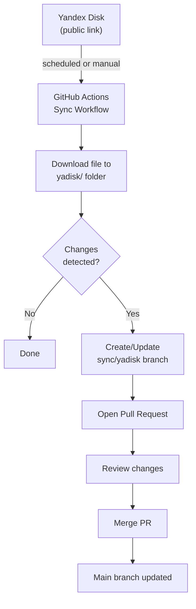

# fpf-sync

> Automatically sync files from Yandex Disk to GitHub + MCP Server for First Principles Framework

## What is this?

This repository does two things:

1. **🔄 Yandex Disk Sync** - Automatically downloads files from Yandex Disk and creates Pull Requests when changes are detected
2. **🤖 MCP Server** - Exposes the First Principles Framework (FPF) specification to AI tools via the Model Context Protocol

## Quick Links

- 📖 [Main FPF Document](yadisk/First%20Principles%20Framework%20%E2%80%94%20Core%20Conceptual%20Specification%20(holonic).md)
- 🏗️ [Architecture Overview](ARCHITECTURE.md) - How everything works
- 👨‍💻 [Developer Guide](DEVELOPERS.md) - Technical details for contributors
- 🔌 [MCP Setup](docs/MCP.md) - Connect to AI tools (VS Code, Claude Desktop)
- 🤝 [Contributing](CONTRIBUTING.md) - How to help improve this project

## Quick Start

**For Users (Non-Technical):**
1. The sync runs automatically every day at 20:00 MSK
2. Check the "Pull requests" tab for updates
3. Review and merge the PR to update the repository

**For Developers:**
```bash
# Install dependencies
bun install

# Run sync locally
bun run yadisk:sync --public-url "https://disk.yandex.ru/d/YOUR_LINK" --verbose true

# Start MCP server
bun run mcp:fpf
```

See [DEVELOPERS.md](DEVELOPERS.md) for detailed setup instructions.

---

## Setup (One-Time)

### Prerequisites
- Yandex Disk public link (a share link anyone can open)
- Repository admin access (to configure GitHub Actions)

### Enable GitHub Actions Permissions
1. Go to: **Settings** → **Actions** → **General** → **Workflow permissions**
2. Select **"Read and write permissions"**
3. Enable **"Allow GitHub Actions to create and approve pull requests"**

### Configure Sync Source
The Yandex Disk link and file selection are pre-configured. To change them:
- See configuration instructions in [DEVELOPERS.md](DEVELOPERS.md)
- Or ask a repository maintainer for help

## How to Use

### Running the Sync
- **Automatic:** Runs daily at 20:00 MSK (17:00 UTC)
- **Manual:** Go to **Actions** → **"Sync Yandex Disk to PR"** → **"Run workflow"**

### What to Expect
1. A Pull Request titled **"Sync: Yandex Disk update"** will be created/updated
2. The file will be in the `yadisk/` folder
3. Review the changes in the **"Files changed"** tab
4. Merge the PR to update the main branch

### How It Works



**Why Pull Requests?**
- Shows exactly what changed (safe review step)
- Nothing changes until you merge
- Easy to download files before or after merging

## Common Tasks

### Reviewing Changes
1. Go to **Pull requests** tab
2. Open **"Sync: Yandex Disk update"**
3. Click **"Files changed"** to see what was modified
4. The sync branch is `sync/yadisk` (merges into `main`)

### Downloading Files
**From a Pull Request (before merging):**
1. Open the PR → **Files changed**
2. Click the file under `yadisk/`
3. Click **"Download raw file"** icon or **"Raw"** → Save

**From main branch (after merging):**
1. Browse to the `yadisk/` folder
2. Click the file
3. Click **"Download raw file"** or **"Raw"** → Save

**Download entire repository:**
- Click green **"Code"** button → **"Download ZIP"**

### Troubleshooting
- **No PR created?** Check [DEVELOPERS.md](DEVELOPERS.md#troubleshooting) for debugging steps
- **Wrong file synced?** Review configuration in [DEVELOPERS.md](DEVELOPERS.md)
- **File too large?** Default limit is 10MB (configurable)

## Technical Details

- **Scheduling:** Daily at 20:00 MSK (best-effort by GitHub Actions)
- **Security:** Filename sanitization, size limits, path validation
- **Branch Strategy:** sync/yadisk → main

For architecture details, see [ARCHITECTURE.md](ARCHITECTURE.md)

For development setup, see [DEVELOPERS.md](DEVELOPERS.md)
