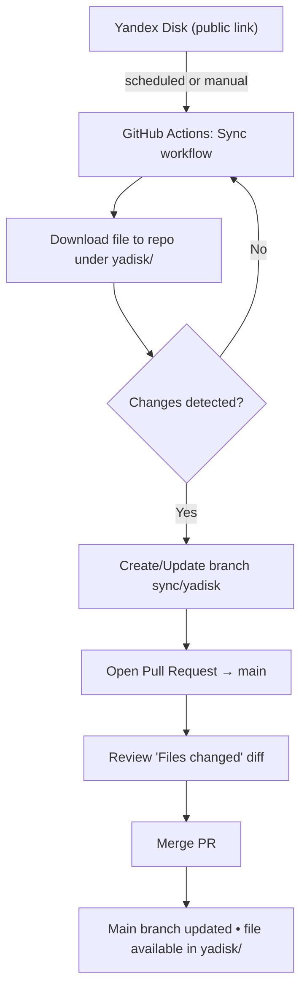

# fpf-sync

MCP server: see docs/MCP.md for the local FPF MCP server that exposes FPF resources and tools over stdio for MCP clients (VS Code Continue, etc.).

Keep a file from a public Yandex Disk link in sync with this repository. When the file changes, this repo automatically opens a Pull Request (PR) with the updated version.

Read the main FPF document: [First Principles Framework — Core Conceptual Specification (holonic).md](<yadisk/First%20Principles%20Framework%20%E2%80%94%20Core%20Conceptual%20Specification%20(holonic).md>)

For developer-focused details (coding, variables, local runs), see `DEVELOPERS.md`.

**What You Need**

- Yandex Disk public link: a share link anyone can open.
- Repo admin access: permission to change GitHub Actions settings.

**One-Time Setup**

- Actions permissions: enable write access and PR creation.
  - Repo → Settings → Actions → General → Workflow permissions
  - Select “Read and write permissions”
  - Turn on “Allow GitHub Actions to create and approve pull requests”
- Source configuration (link and file selection) is pre‑set. If it needs to change, ask a developer to update it (see `DEVELOPERS.md`).

**Run the Sync**

- Automatic: runs daily at 20:00 MSK (17:00 UTC).
- Manual: Repo → Actions → "Sync Yandex Disk to PR" → Run workflow.

**What You’ll See**

- A new or updated PR titled “Sync: Yandex Disk update”.
- The downloaded file stored under the `yadisk/` folder in the PR.
- Merge the PR to update the repository.

**How It Works (Diagram)**

What the PR does:

- Shows exactly what changed in the file (safe review step).
- Nothing changes in the main branch until the PR is merged.
- You can download the file from the PR (before merge) or from main (after merge).

**Review Changes (Diffs) On GitHub**

- Open Pull Requests: Repo → Pull requests → select “Sync: Yandex Disk update”.
- Files Changed tab: shows exactly what changed inside `yadisk/…`.
- Compare view (optional): visit `Compare changes` in the PR to see side‑by‑side diffs.
- Tip: The sync branch is `sync/yadisk` (base is `main`).

**Download The File (No Coding Needed)**

- From the PR before merging:
  - Open the PR → Files changed → click the changed file under `yadisk/`.
  - Click “Download raw file” (download icon) or “Raw”, then use your browser’s Save.
- After merging to main:
  - Go to the repo’s `yadisk/` folder → click the file.
  - Click “Download raw file” (download icon) or “Raw”, then Save.
- Download everything (ZIP): Repo → Code (green button) → Download ZIP, then open the `yadisk/` folder inside.

**Notes**

- Scheduling is best‑effort by GitHub; runs may be slightly delayed.
- Basic safety is built in: filenames are cleaned, and large files are blocked by a size limit.
- If something doesn’t look right, contact a maintainer. Technical troubleshooting lives in `DEVELOPERS.md`.
